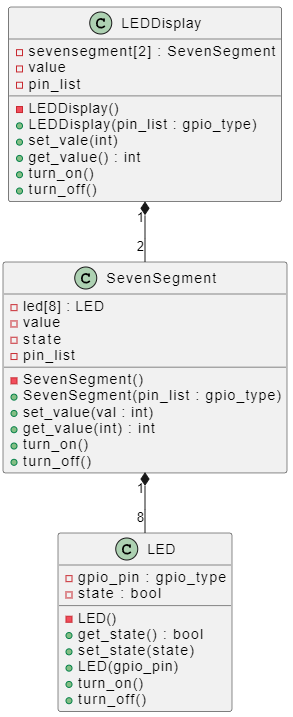

```plantuml
class LED 
{
    - gpio_pin : gpio_type
    - state : bool
    - LED()
    + get_state() : bool
    + set_state(state)
    + LED(gpio_pin)
    + turn_on()
    + turn_off()
}

class SevenSegment
{
    - led[8] : LED
    - value
    - state
    - pin_list
    - SevenSegment()
    + SevenSegment(pin_list : gpio_type)
    + set_value(val : int)
    + get_value(int) : int
    + turn_on()
    + turn_off()
}
class LEDDisplay
{
    - sevensegment[2] : SevenSegment
    - value
    - pin_list
    - LEDDisplay()
    + LEDDisplay(pin_list : gpio_type)
    + set_vale(int)
    + get_value() : int
    + turn_on()
    + turn_off()
}


LEDDisplay "1" *-- "2" SevenSegment
SevenSegment "1" *-- "8" LED


```

